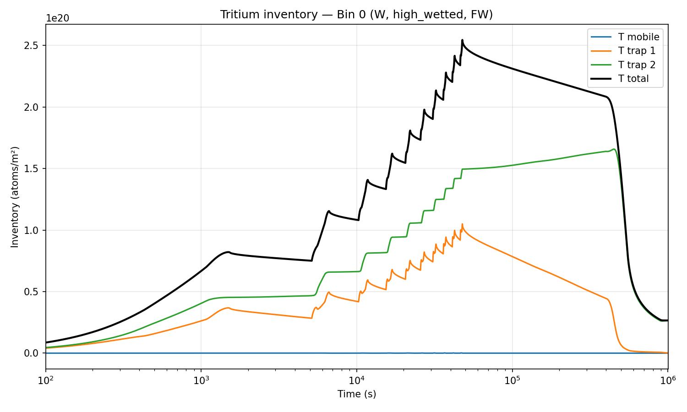

# Example: ITER tritium retention simulation

This folder recreates the bin definitions and operational scenarios shown in the
paper below. It demonstrates how to:

1. Define the plasma-facing component segments (bins) of a reactor with their
   geometry, materials, and trap parameters.
2. Run HISP on a single bin to solve the hydrogen isotope transport equations
   (diffusion + trapping) via FESTIM and obtain time-resolved retention results.

Reference:
> Dunnell, K., Lleal, A., Hodille, E. A., Dufour, J., Delaporte-Mathurin, R., & Wauters, T. (2026).
> *Hydrogen Inventory Simulations for PFCs (HISP)*.
> arXiv:2604.04751. https://arxiv.org/abs/2604.04751

## Files

| File | Purpose |
|------|---------|
| `make_iter_bins.py` | Creates 94 Bin objects (62 poloidal segments × wetted modes) matching ITER Scenario A |
| `scenarioA.py` | 9 FP + 1 FP (4-day wait) + bake at 483 K |
| `scenarioB.py` | 10 FP + 2-day GDC + bake |
| `scenarioC.py` | 5 DT + 1 DD + 5 DT + 1 DD + 2-day GDC + bake |
| `run_single_bin.py` | Main script — runs one bin with a chosen scenario |
| `plot_T_inventory.py` | Plots tritium inventory from results JSON |
| `data/` | Binned plasma flux data (ion/atom fluxes, energies, heat loads per bin) |

## How to run

Activate the PFC-TT conda environment (which should already have `PFC_TT_PATH` set — see the main HISP README for setup).

```bash
conda activate PFC-TT
cd hisp/example
python run_single_bin.py --bin-index 0 --scenario scenarioA
```

Options:
- `--bin-index N` — which bin to simulate (0–93)
- `--scenario {do_nothing, capability_test, just_glow}`

Results are saved as JSON in `results_binN_<material>_<mode>/`.

## Post-processing

`plot_T_inventory.py` reads the results JSON and plots the total tritium
inventory over time, decomposed into its mobile and trapped contributions
(one curve per trap). This gives a clear view of how retention evolves
through the pulse sequence and where tritium accumulates within the material.

Below is the result for bin 0 — the high-wetted sub-bin of ITER's First Wall
Panel 1 — run with Scenario A:


